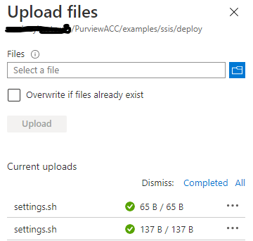
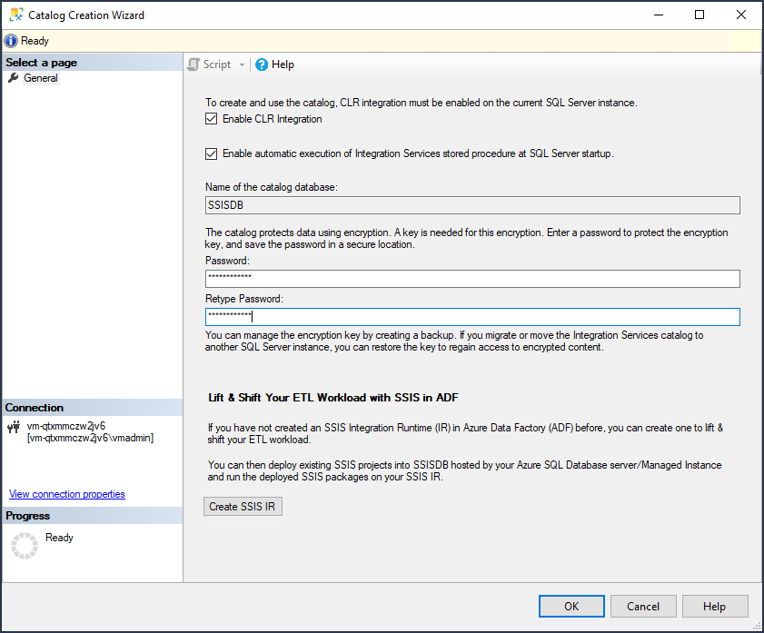
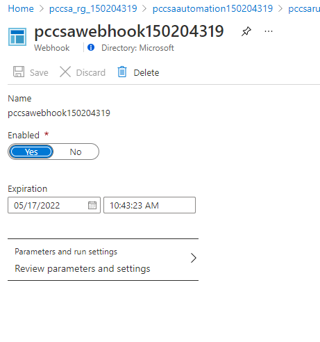

# Deploy ETL Lineage Example (SSIS)

## Components


## Prerequisite

Follow the instructions for deploying the base solution under [purview_connector_services](../../../purview_connector_services/deploy/deploy_sa.md)

## Run Installation Script

* Fill in the secrets file with virtual machine credentials. Use 'vmadmin' for the user name.
* To run script
  * Start the cloud CLI in bash mode
  * cd to the cloud storage directory (clouddrive)
  * upload the settings.sh file (created above) to the examples/ssis/deploy directory using the Upload/Download files tool

  

  * Choose the "Manage file share" option, navigate to the PurviewACC/examples/ssis/deploy directory and copy the settings.sh file into this directory
  
  

  

  * navigate to the PurviewACC/examples/ssis/deploy directory and run the deploy_ssis.sh script (./deploy_ssis.sh)

## Configure the SQL Server VM

* RDP into the VM using the username and password from your settings.sh file
* If asked to publish identity to the network, select 'Yes'
* From the Server -> Local Server pane, turn off IE Enhanced Security Mode Configuration
* [Install .NET Framework 4.8 or later](https://dotnet.microsoft.com/download/dotnet-framework/net48) Runtime (requires reboot of the VM)
* Install the necessary PowerShell modules for running the Hybrid Runbook - if prompted, select 'Yes' in all cases
  * Start PowerShell as Admin
  * Make sure you have the latest version of PowerShellGet

  ```PowerShell
  Install-Module -Name PowerShellGet -Force
  ```

  * Set the appropriate execution policy
  
  ```PowerShell
  Set-ExecutionPolicy -ExecutionPolicy RemoteSigned -Scope CurrentUser
  ```

  * Install the Az CLI - this takes some time, you can go to the next section and install SSIS Services in parallel
  
    _Note: This installation can appear to hang. If it runs for a significant time after the progress indicators are shown, press any key in the command window to continue._
  
  ```PowerShell
  Install-Module -Name Az -Scope CurrentUser -Repository PSGallery -Force
  ```

  * Install the Az storage module
  
  ```PowerShell
  Install-Module -Name Az.Storage -Force
  ```

  * Install the SQL Server module
  
  ```PowerShell
  Install-Module -Name SqlServer -AllowClobber
  ```

* Install SSIS Services
  * Open SQL Server Management Studio by typing the name at the start menu
  * Connect to the local server using Windows authentication (should be the default option)
  * Right click the integration services catalogs item and choose "Create catalog"
  * Enable CLR integration and running SSIS sp at start up, type a password and choose "OK"

  

  * Install the [SSIS Azure Feature Pack](https://www.microsoft.com/en-us/download/details.aspx?id=100430) (x64 version). Be sure you have disabled IE enhanced security from the Server panel as mentioned above
* Sample Data
  * Copy all .sql files under PurviewACC\examples\ssis\example_data to a folder on the virutal machine (e.g. c:\sql_files)
  * On the VM, within SSMS, choose File->Open->File and open the CreateDb.sql script.  Execute the script to create the purview-sqlmi-db database
  * Repeat the above step running the CreateCustomer.sql and CreateMovies.sql scripts
* Import SSIS Project
  * Open file explorer and create an ssis_packages directory under c:
  * Copy the PurviewACC/examples/ssis/example_ssis_project/simple_example_ssis_project.ispac and paste into the ssis_packages directory you created on the VM
  * Use [isdeploymentwizard.exe](https://docs.microsoft.com/en-us/sql/integration-services/packages/deploy-integration-services-ssis-projects-and-packages?view=sql-server-ver15) (Find by typing "isdeploymentwizard at start menu) to import the project
  * Go to "Select Source", select "Project Deployment" and browse for the .ispac file you created above.  Select "Next"
  * Under Select Deployment Target, choose SSIS in SQL Server to mimic on prem SQL SSIS environment
  * Under Select Destination choose to browse for the server name and select the local instance
  * Choose to browse for the path, select SSISDB and then choose to create a new folder.  Call it 'ssistest' and choose "OK" (The name is important as it must match the name in the Synapse pipeline FolderName parameter)
  * Choose next to review your options, then choose "Deploy"

## Automation Services

* On the VM
  * Most of the automation configuration has been completed for you by scripts. The remaining step must be done while remoted into the VM
    * Open a PowerShell session in Administrator mode and run the following commands to import the module. Replace version in the path with the version number appearing in your filesystem

    ```bash
    cd "C:\Program Files\Microsoft Monitoring Agent\Agent\AzureAutomation\<version>\HybridRegistration"
    Import-Module .\HybridRegistration.psd1

    ```

  * Run the Add-HybridRunbookWorker cmdlet specifying the values for the parameters Url, Key, and GroupName (hybrid group) from the Automation Account -> Keys pane in the Azure Portal. You can choose your own value for GroupName

    ```bash
    Add-HybridRunbookWorker –GroupName <String> -Url <Url> -Key <String>
    ```

The Hybrid Runbook works like SHIR does for native connectors. It runs the Powershell script using the Azure Log Analytics agent on the VM or on premises server.

* In the Azure Portal
  * Change the Webhook to run a Hybrid runbook in the newly created hybrid group
    * In Azure Portal open the automation account
    * Go to 'Runbooks' and open your specific runbook
    * Go to Webhooks link in the left pane


*
  *
    * Select the Webhook
    * Open Parameters and run settings



*
  *
    * Select "Hybrid Worker" under "Run Settings"
    * Choose the Hybrid Worker group from the drop down


*
  *
    * Be sure to hit the 'Save' button in the next screen
    * Click into the Hybrid Worker Group -> Hybrid worker group settings and set it to use the existing custom credentials


## Running the Example Solution
* [Follow the instructions for deploying the prerequisites, base service, and SSIS example](https://github.com/microsoft/Purview-Custom-Connector-Solution-Accelerator/blob/master/examples/ssis/ssis.md#running-the-example-solution)

### Hybrid Runbook references

* [Configure identity](https://blog.ctglobalservices.com/azure/jgs/azure-automation-setting-run-as-account-on-hybrid-worker-groups/)
* [General guidance](https://docs.microsoft.com/en-us/azure/automation/automation-windows-hrw-install)
* [Manual Configuration Step by Step](https://docs.microsoft.com/en-us/azure/automation/automation-windows-hrw-install#manual-deployment)

## Reference - script actions

* Pull in service names and data from base install
* Pull in VM credentials
* Add SSIS Example directories to storage
* Upload PowerShell scripts to storage - for use in Automation Runbooks
* Deploy Log Analytics, Azure Automation, Runbook, and Webhook
* Enable Log Analytics account for hybrid automation
* Store VM credentials in KeyVault
* Deploy VM networking
  * Public IP Address
  * Network security group
  * Network interface
  * VNet
  * SubNet
* Deploy VM
  * Standard DS13 V2
  * SQL Server 2019 + SSIS, SSMS, etc.
  * Automation Hybrid Runbook agent extension
  * Save VM name, and webhook uri
* Synapse
  * Datasets
  * Notebooks
  * Pipeline
  
## Privacy

To opt out of information collection as described in [privacy.md](../../../PRIVACY.md), remove the described section from all templates in the PurviewACC/examples/ssis/deploy/arm directory.
